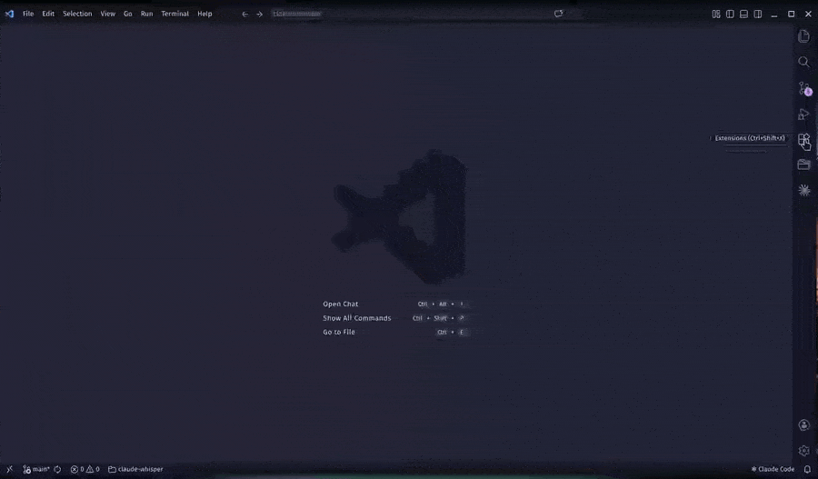

# Claude Whisper

Speak your prompts instead of typing them — Claude Whisper records your voice and pastes the transcription directly into the [Claude Code](https://marketplace.visualstudio.com/items?itemName=anthropic.claude-code) chat input, keeping you in flow without switching context.

> **Linux only** — macOS and Windows support coming soon.



## How it works

Press `Ctrl+Shift+V` while the Claude Code input is focused to toggle recording:

1. **First press** — starts recording from your microphone
2. **Second press** — stops recording, transcribes speech to text, and pastes the result into Claude Code

## Requirements

- **Claude Code** extension installed and active
- **Python 3** available on your system
- **One of the following audio tools** (detected automatically in order):
  - `parecord` — part of `pulseaudio-utils`
  - `arecord` — part of `alsa-utils`
  - `pw-record` — part of `pipewire`

Most Linux desktop systems already have at least one of these installed.

## First run

On first use, Claude Whisper will:

1. **Install `faster-whisper`** into the extension's private storage (`~/.config/Code/User/globalStorage/...`). This is a one-time setup that takes ~30 seconds and requires an internet connection.
2. **Download the Whisper `small` speech model** (~460 MB) to `~/.cache/huggingface/hub/`. This also happens once and is cached permanently.

Subsequent uses are fast — no downloads, no setup.

## Changing the keyboard shortcut

Open the Keyboard Shortcuts editor (`Ctrl+K Ctrl+S`), search for **Claude Whisper: Toggle Recording**, and assign any key combination you prefer.

## Troubleshooting

### "Unable to watch for file changes" (Linux)

VS Code shows this warning when the system's inotify watch limit is too low. Claude Whisper detects this at startup and will prompt you with a fix. If you see the notification, click **Copy fix command**, paste it into a terminal, and run it:

```bash
echo fs.inotify.max_user_watches=524288 | sudo tee -a /etc/sysctl.conf && sudo sysctl -p
```

This is a standard Linux system tuning setting — not specific to this extension. It tells the kernel to allow more file watchers, which VS Code needs on larger projects. The change persists across reboots.

## Why this exists

The Claude Code VS Code extension has no built-in voice input. Claude Whisper fills that gap — audio is recorded locally, transcribed on your machine with Whisper, and inserted directly into the Claude Code input without any copy-paste step.

## Privacy

All processing is local. Your audio is never sent to any server — transcription runs entirely on your machine using the Whisper model.
